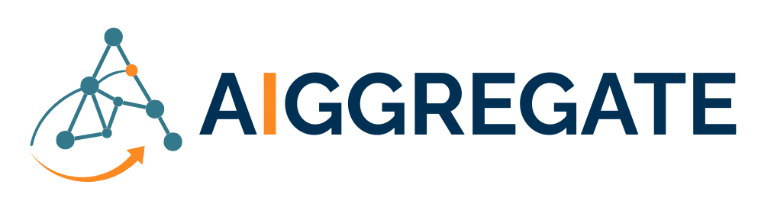

# Resilient Collective Awareness Ontology (RCAO)

RCAO offers a minimal set of classes and relations to guide the representation of knowledge in RDF/OWL.

The ontoloy IRI is: [https://w3id.org/rcao/](https://w3id.org/rcao/)

Here's the RCAO Postcard showing all the classes and relations:<br>


## Availability
The ontology is available in a number of formats:
* [Turtle](./versions/latest/rcao.ttl)
* [RDF/XML](./versions/latest/rcao.owl)
* [JSON-LD](./versions/latest/rcao.jsonld)
* [NTriples](./versions/latest/rcao.nt)


You can retrieve any of these through content type negotiation
```
curl -L -H "Accept: text/turtle https://w3id.org/rcao
curl -L -H "Accept: application/ld+json" https://w3id.org/rcao
curl -L -H "Accept: application/rdf+xml" https://w3id.org/rcao
curl -L -H "Accept: application/n-triples" https://w3id.org/rcao
```

In addition, individual versions of RCAO are available through the ontology IRI pattern ```https://w3id.org/rcao/rcao-X.X.X.ttl```  All versions of the ontology are available from [github](rcao/)


## Documentation
We automatically generate documentation for RCAO using OntoSpy, Pylode and Widoco wizard:

* [OntoSpy](https://vicomtech.github.io/rcao/docs/ontospy/html-multi-page/index.html)
* [Widoco](https://vicomtech.github.io/rcao/versions/latest/index-en.html)

## Contributing

## Cite


## Acknowledgment

This work is fully supported by the EU AIGREGGATE ([https://cordis.europa.eu/project/id/101202457](https://cordis.europa.eu/project/id/101202457)] project funded from the European Union´s Horizon 2027 research and innovation program under the grant agreement no ```10.3030/101202457```.
<br>



