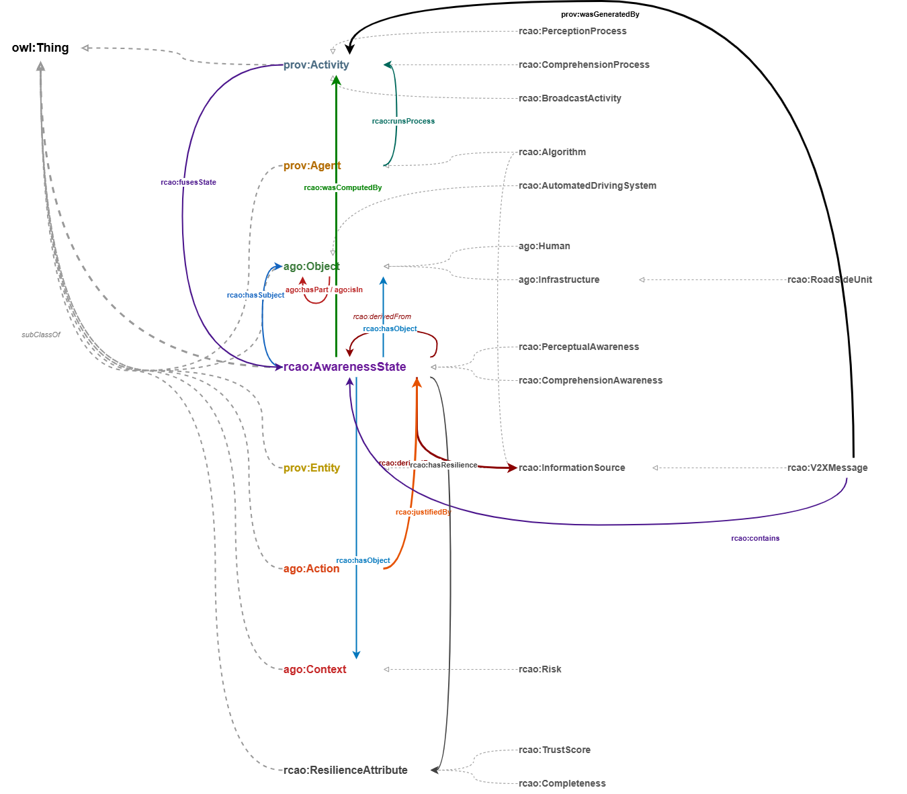

# Resilient Collective Awareness Ontology (RCAO)

RCAO offers a minimal set of classes and relations to guide the representation of knowledge in RDF/OWL.

The ontoloy IRI is: [https://w3id.org/rcao/](https://w3id.org/rcao/)

Here's the RCAO Postcard showing all the classes and relations (solid line indicates connection between domain/range; dotted line indicates restriction on use in class axiom. Dashed Gray Lines = Class Axioms (rdfs:subClassOf) | Solid Curved Lines = Object Properties (Domain to Range)) 

## Availability
The ontology is available in a number of formats:
* [Turtle](./versions/latest/rcao-v0.7.ttl)
* [RDF/XML]()
* [JSON-LD]()
* [NTriples]()

## Documentation
We automatically generate documentation for RCAO using OntoSpy, Pylode and Widoco wizard:

* [OntoSpy](https://rca-datamodel-a24b0f.gitlab.io/ontospy/)
* [Widoco](https://rca-datamodel-a24b0f.gitlab.io)

## Contributing

## Cite

## License
For open source projects, say how it is licensed.

## Project status
Work In Progress (WIP)
