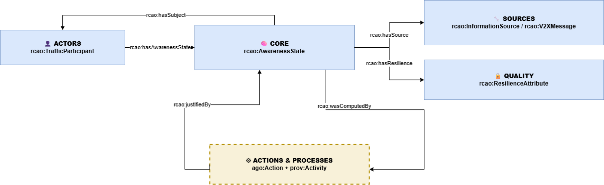

# Resilient Collective Awareness Ontology (RCAO)

RCAO offers a minimal set of classes and relations to guide the representation of knowledge in RDF/OWL.

The ontoloy IRI is: [https://w3id.org/rcao/](https://w3id.org/rcao/)

Here's the RCAO Postcard showing all the classes and relations: 

## Availability
The ontology is available in a number of formats:
* [Turtle](./rcao/latest/ontology.ttl)
* [RDF/XML](./rcao/latest/ontology.owl)
* [JSON-LD](./rcao/latest/ontology.jsonld)
* [NTriples](./rcao/latest/ontology.nt)

## Documentation
We automatically generate documentation for RCAO using OntoSpy, Pylode and Widoco wizard:

* [OntoSpy](https://vicomtech.github.io/rcao/docs/ontospy/html-multi-page/index.html)
* [Widoco](https://vicomtech.github.io/rcao/rcao/latest/index-en.html)

## Contributing

## Cite

## License
For open source projects, say how it is licensed.

## Project status
Work In Progress (WIP)

